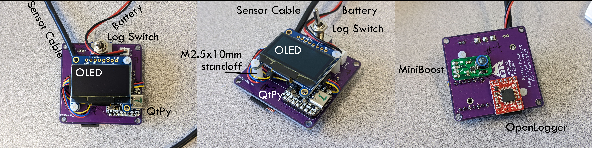
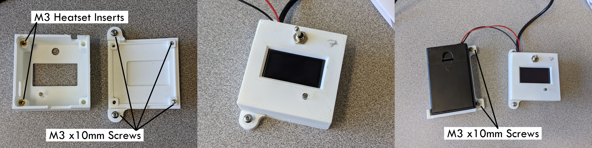
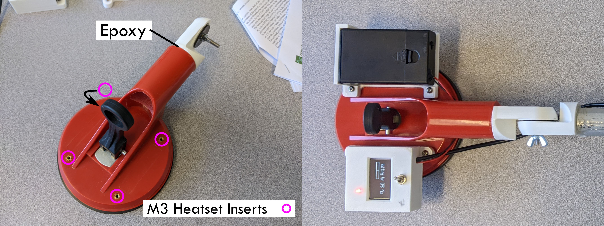
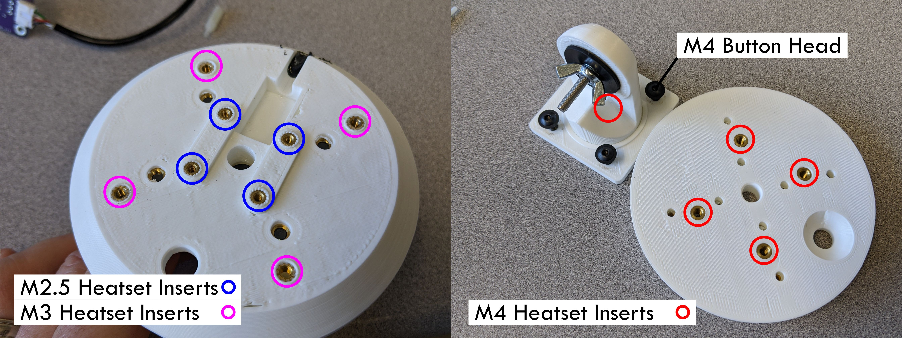
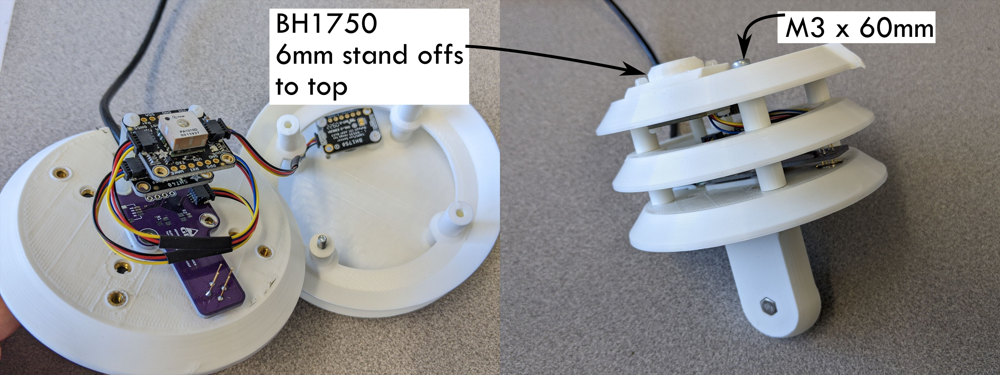

# Basic build log for the sensors

### More detailed build log coming in early 2024

1. Print 3D Parts add heat set inserts per the images below
2. Order Circuit Boards - assemble per the photos below
3. Suction mount - Cut the suction mount in half across the handle, drill and add heat set inserts
4. Arm - Epoxy the arm/elbow parts into the suction mount and aluminium pipe
5. Assemble all the parts together
6. Upload the Circuit Python Firmware (Code folder) to the QTPy RP2040
7. Uploard the main logging code to the QTPy
---

